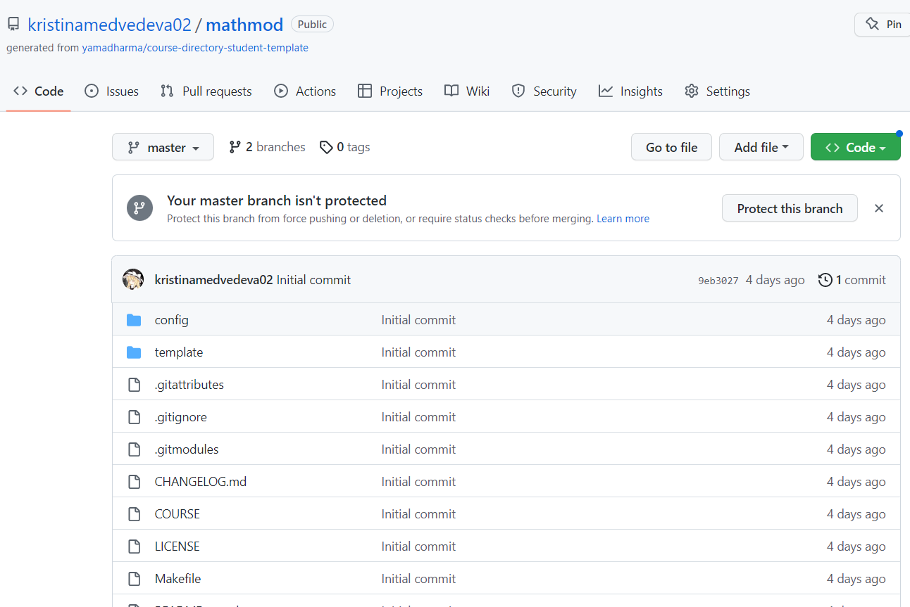
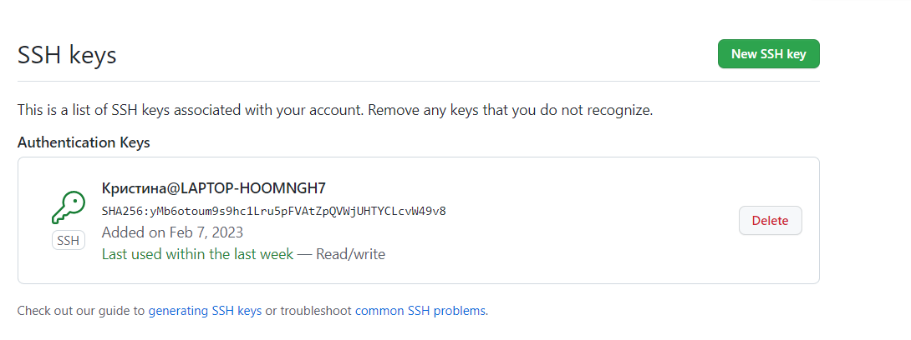
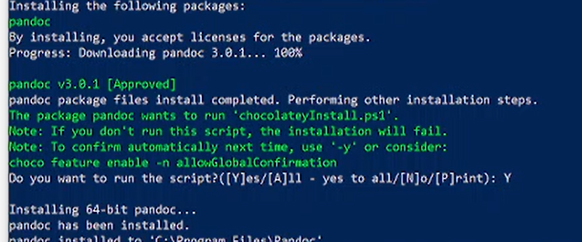
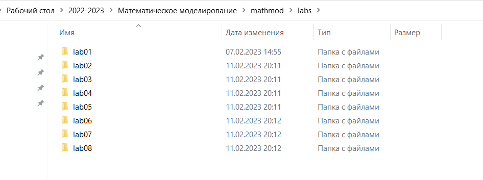
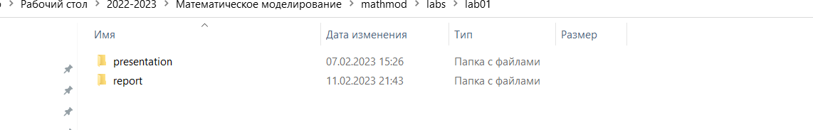
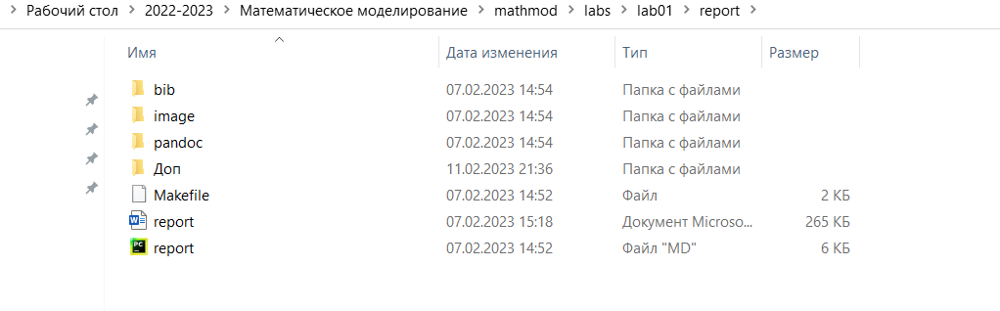

---
## Front matter
lang: ru-RU
title: Лабораторная работа №1

author:
  - Медведева Кристина Андреевна
institute:
  - Российский университет дружбы народов, Москва, Россия

date: 11 февраля 2023

## i18n babel
babel-lang: russian
babel-otherlangs: english

## Formatting pdf
toc: false
toc-title: Содержание
slide_level: 2
aspectratio: 169
section-titles: true
theme: metropolis
header-includes:
 - \metroset{progressbar=frametitle,sectionpage=progressbar,numbering=fraction}
 - '\makeatletter'
 - '\beamer@ignorenonframefalse'
 - '\makeatother'
---

# Информация

## Выполнял:

  * Медведева Кристина Андреевна
  * группа: НПИбд-01-20
  * Российский университет дружбы народов

## Цель работы:
- Настройка и подготовка рабочего пространства для работы с git.

# Ход работы:
##
1. Устанавливаем git. Настраиваем его работу.
2. Создаем в папке 2022-2023, где размещаем папку "Математическое моделирование", где создаем папку "mathmod".
{#fig:001 width=70%}

---
3. Создаем репозиторий по шаблону.
{#fig:001 width=70%}

---
4. Создаем ssh ключи и подключаемся с помощью git.
{#fig:001 width=70%}
{#fig:001 width=70%}

---
5. Скачиваем pandoc.
{#fig:001 width=70%}
---
6. Создаем папку с лабораторными работами, где создаем папки для каждой лабораторной. 
{#fig:001 width=70%}
---
7. В папки с лабораторными работами помещаем 2 папки: report  presentation.
{#fig:001 width=70%}
---
8. В каждой из папок применяем make, чтобы получить pdf и docx файлы из файла маркдауна.
{#fig:001 width=70%}
---
9. Редактируем файлы с отчетами.
10. Обновляем содержимое репозитория.
---

# Вывод
Проделав работу, мы настроили и подготовили рабочее пространтсво для работы с git.

::: incremental

:::

