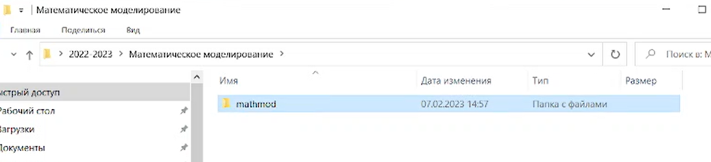
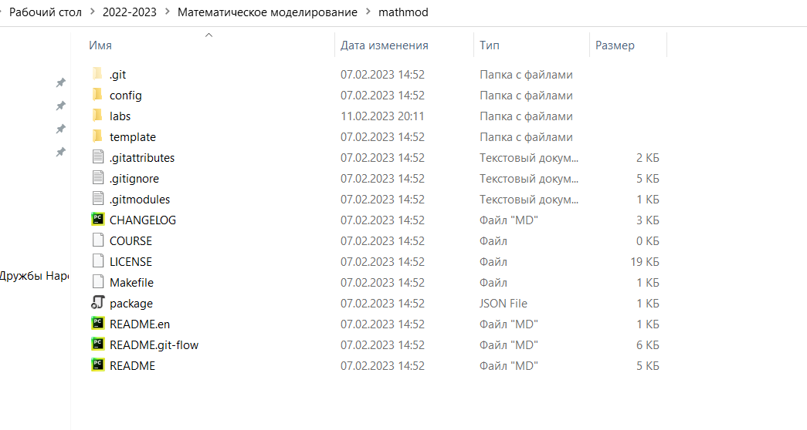
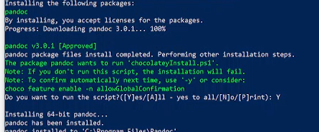
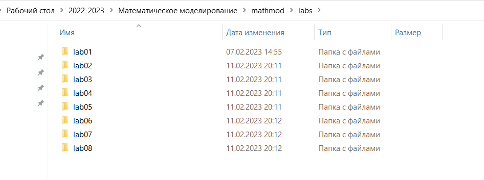
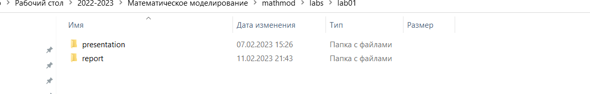

---
## Front matter
title: "Отчёта по лабораторной работе №1"
author: "Медведева Кристина Андреевна"
group: "НПИбд-01-20"

## Generic otions
lang: ru-RU
toc-title: "Содержание"

## Bibliography
bibliography: bib/cite.bib
csl: pandoc/csl/gost-r-7-0-5-2008-numeric.csl

## Pdf output format
toc: true # Table of contents
toc-depth: 2
lof: true # List of figures
lot: true # List of tables
fontsize: 12pt
linestretch: 1.5
papersize: a4
documentclass: scrreprt
## I18n polyglossia
polyglossia-lang:
  name: russian
  options:
	- spelling=modern
	- babelshorthands=true
polyglossia-otherlangs:
  name: english
## I18n babel
babel-lang: russian
babel-otherlangs: english
## Fonts
mainfont: PT Serif
romanfont: PT Serif
sansfont: PT Sans
monofont: PT Mono
mainfontoptions: Ligatures=TeX
romanfontoptions: Ligatures=TeX
sansfontoptions: Ligatures=TeX,Scale=MatchLowercase
monofontoptions: Scale=MatchLowercase,Scale=0.9
## Biblatex
biblatex: true
biblio-style: "gost-numeric"
biblatexoptions:
  - parentracker=true
  - backend=biber
  - hyperref=auto
  - language=auto
  - autolang=other*
  - citestyle=gost-numeric
## Pandoc-crossref LaTeX customization
figureTitle: "Рис."
tableTitle: "Таблица"
listingTitle: "Листинг"
lofTitle: "Список иллюстраций"
lotTitle: "Список таблиц"
lolTitle: "Листинги"
## Misc options
indent: true
header-includes:
  - \usepackage{indentfirst}
  - \usepackage{float} # keep figures where there are in the text
  - \floatplacement{figure}{H} # keep figures where there are in the text
---

# Цель работы

Настройка и подготовка рабочего пространства для работы с git.

# Задание
1. Создать шаблон рабочего пространства, где расположить файлы с лаборотарными работами.

| Имя каталога | Описание каталога                                                                                                          |
|--------------|----------------------------------------------------------------------------------------------------------------------------|
| `/`          | Корневая директория, содержащая всю файловую                                                                               |
| `/bin `      | Основные системные утилиты, необходимые как в однопользовательском режиме, так и при обычной работе всем пользователям     |
| `/etc`       | Общесистемные конфигурационные файлы и файлы конфигурации установленных программ                                           |
| `/home`      | Содержит домашние директории пользователей, которые, в свою очередь, содержат персональные настройки и данные пользователя |
| `/media`     | Точки монтирования для сменных носителей                                                                                   |
| `/root`      | Домашняя директория пользователя  `root`                                                                                   |
| `/tmp`       | Временные файлы                                                                                                            |
| `/usr`       | Вторичная иерархия для данных пользователя                                                                                 |

Более подробно об Unix см. в [@gnu-doc:bash;@newham:2005:bash;@zarrelli:2017:bash;@robbins:2013:bash;@tannenbaum:arch-pc:ru;@tannenbaum:modern-os:ru].

# Выполнение лабораторной работы

1. Устанавливаем git. Настраиваем его работу.
2. Создаем в папке 2022-2023, где размещаем папку "Математическое моделирование", где создаем папку "mathmod".
{#fig:001 width=70%}
3. Создаем репозиторий по шаблону.
{#fig:001 width=70%}
4. Создаем ssh ключи и подключаемся с помощью git.
{#fig:001 width=70%}
{#fig:001 width=70%}
5. Скачиваем pandoc.
{#fig:001 width=70%}
6. Создаем папку с лабораторными работами, где создаем папки для каждой лабораторной. 
{#fig:001 width=70%}
7. В папки с лабораторными работами помещаем 2 папки: report  presentation.
{#fig:001 width=70%}
8. В каждой из папок применяем make, чтобы получить pdf и docx файлы из файла маркдауна.
{#fig:001 width=70%}
9. Редактируем файлы с отчетами.
10. Обновляем содержимое репозитория.

# Вывод
Проделав работу, мы подготовили рабочее пространство для работы с git.

# Литература
::: {#refs}
:::
