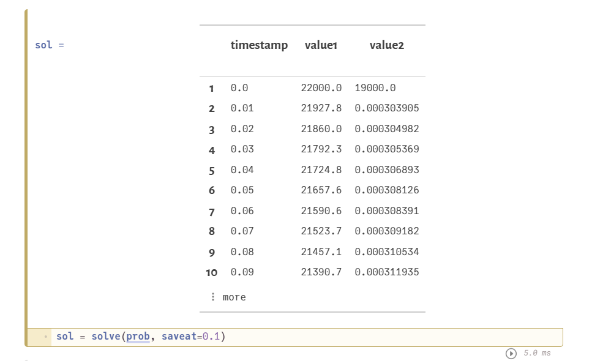

---
## Front matter
title: "Лабораторная работа №3. Вариант 3"

author: "Медведева Кристина Андреевна"

## Generic otions
lang: ru-RU
toc-title: "Содержание"

## Bibliography
bibliography: bib/cite.bib
csl: pandoc/csl/gost-r-7-0-5-2008-numeric.csl

## Pdf output format
toc: true # Table of contents
toc-depth: 2
lof: true # List of figures
lot: true # List of tables
fontsize: 12pt
linestretch: 1.5
papersize: a4
documentclass: scrreprt
## I18n polyglossia
polyglossia-lang:
  name: russian
  options:
	- spelling=modern
	- babelshorthands=true
polyglossia-otherlangs:
  name: english
## I18n babel
babel-lang: russian
babel-otherlangs: english
## Fonts
mainfont: PT Serif
romanfont: PT Serif
sansfont: PT Sans
monofont: PT Mono
mainfontoptions: Ligatures=TeX
romanfontoptions: Ligatures=TeX
sansfontoptions: Ligatures=TeX,Scale=MatchLowercase
monofontoptions: Scale=MatchLowercase,Scale=0.9
## Biblatex
biblatex: true
biblio-style: "gost-numeric"
biblatexoptions:
  - parentracker=true
  - backend=biber
  - hyperref=auto
  - language=auto
  - autolang=other*
  - citestyle=gost-numeric
## Pandoc-crossref LaTeX customization

## Misc options
indent: true
header-includes:
  - \usepackage{indentfirst}
  - \usepackage{float} # keep figures where there are in the text
  - \floatplacement{figure}{H} # keep figures where there are in the text
---

# Цель работы
Смоделировать простейшую модель боевых действий.

# Задание
1. Рассмотреть 2 случая ведения боевых действий.
2. Рассмотреть уравнения хода боевых действий.
3. Смоделировать модель.

                                                                            
# Выполнение лабораторной работы
1. Добавить необходимые пакеты.

2. Определить функцию хода боевых действий для 1 и 2 заданий (между регулярными войсками, с использованием партизанских отрядов).
{#fig:001 width=70%}

3. Определяем данные для графика.
{#fig:001 width=70%}

4. Рисуем графики
{#fig:001 width=70%}
{#fig:001 width=70%}

# Вывод

Проделав работу, мы смоделировали два простейших графика хода боевых действий.

::: {#refs}
:::
