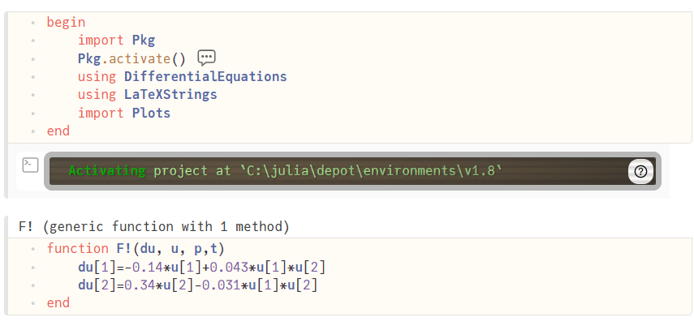
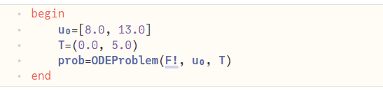
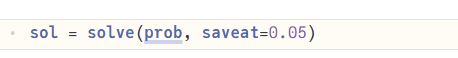
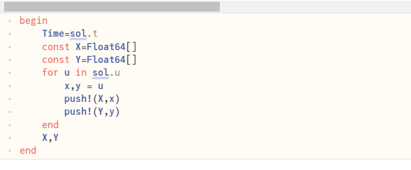
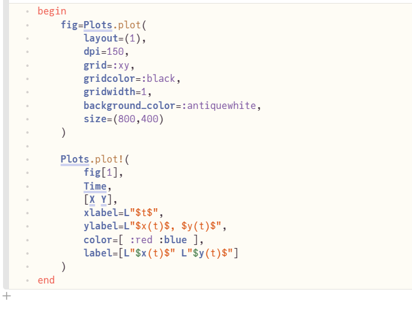
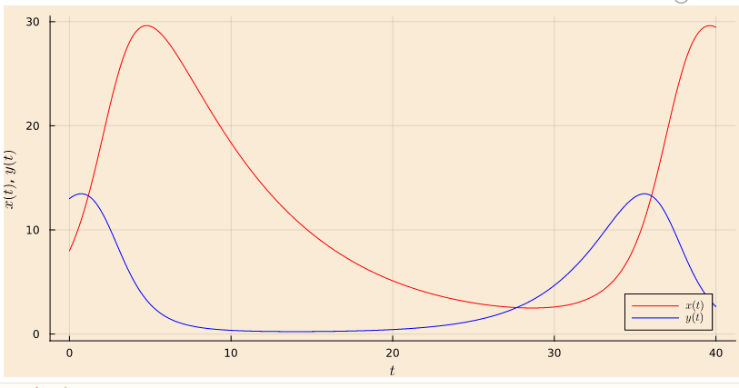

---
## Front matter
lang: ru-RU
title: Презентация лабораторной работы №5
author:
  - Медведева Кристина Андеевна
institute:
  - Российский университет дружбы народов, Москва, Россия

## i18n babel
babel-lang: russian
babel-otherlangs: english

## Formatting pdf
toc: false
toc-title: Содержание
slide_level: 2
aspectratio: 169
section-titles: true
theme: metropolis
header-includes:
 - \metroset{progressbar=frametitle,sectionpage=progressbar,numbering=fraction}
 - '\makeatletter'
 - '\beamer@ignorenonframefalse'
 - '\makeatother'
---

# Информация

:::::::::::::: {.columns align=center}
::: {.column width="70%"}

:::
::: {.column width="30%"}

---

:::
::::::::::::::

# Выполнение

---
## 
1. Подключаем необходимые пакеты.
{#fig:001 width=70%}
2. Создаем основную функцию отрисовки, в соответствии с 3 вариантом.
3. Отрисовка графика.
---
:::
:::::::::::::

{#fig:001 width=70%}

{#fig:001 width=70%}

---
::: incremental
{#fig:001 width=70%}
::: incremental
---
{#fig:001 width=70%}
::: incremental
--
{#fig:001 width=70%}
::: incremental
---

:::

:::

